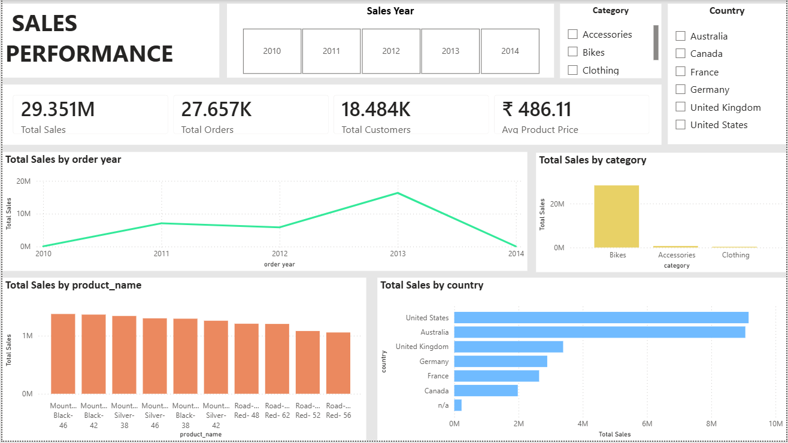

# Enterprise Sales Analytics Data Platform

An end-to-end sales analytics platform built using **SQL Server, T-SQL, SSAS Tabular, DAX, and Power BI**.

This project integrates CRM and ERP datasets, builds a SQL Server Data Warehouse using **Medallion Architecture**, creates a **Gold-layer Star Schema**, performs SQL-based EDA and Advanced Analytics, develops an **SSAS Tabular semantic model with reusable DAX measures**, and delivers an interactive **Power BI dashboard through a Live Connection to SSAS**.

---

## Project Overview

The project was developed incrementally as a complete analytics solution, progressing from raw source data to data warehousing, analytics, semantic modeling, and business intelligence.

### Key Components

- SQL Server Data Warehouse
- Bronze, Silver, and Gold layers
- CRM and ERP data integration
- Data cleaning and data quality checks
- Gold-layer Star Schema
- Exploratory Data Analysis (EDA)
- Advanced SQL Analytics
- Customer and Product Reporting
- SSAS Tabular Semantic Model
- DAX Measures
- Power BI Live Connection
- Interactive Sales Dashboard

### Objective

To transform raw CRM and ERP data into a structured analytical platform that supports business analysis and interactive reporting.

---

## High-Level Architecture

The high-level architecture provides an overview of the end-to-end technology flow of the platform.


---

## Detailed Architecture

The detailed architecture illustrates the complete solution, including the SQL Server Data Warehouse layers, Gold-layer Star Schema, EDA and Advanced Analytics, SSAS Tabular semantic model, DAX measures, and Power BI.


# Technology Stack

| Technology | Purpose |
|---|---|
| **Microsoft SQL Server** | Data warehouse and analytical database |
| **T-SQL** | Data loading, transformation, quality checks, analysis, and reporting |
| **Medallion Architecture** | Bronze, Silver, and Gold data organization |
| **Star Schema** | Analytical data modeling |
| **SSAS Tabular** | Semantic and analytical modeling |
| **DAX** | Reusable business and analytical measures |
| **Power BI** | Interactive reporting and visualization |
| **Excel** | Analytical consumption of the SSAS model |
| **CSV** | CRM and ERP source data |

---

# 1. Data Sources

The project uses CRM and ERP datasets in CSV format.

### CRM

- Customer information
- Product information
- Sales transactions

### ERP

- Customer information
- Location information
- Product category information

The source datasets contain data-quality issues that are addressed during the Silver-layer transformation process.

---

# 2. SQL Server Data Warehouse

The Data Warehouse is implemented using **Microsoft SQL Server** and follows the **Medallion Architecture**.

### Bronze Layer

The Bronze layer stores the source data in its raw form.

Key activities:

- Source data ingestion
- Raw data storage
- Bulk data loading

A stored procedure is used to perform bulk loading into the Bronze layer.

### Silver Layer

The Silver layer contains cleaned and transformed data.

Key activities:

- Data quality checks
- Data cleaning
- Data transformation
- Data standardization
- CRM and ERP data integration
- Loading cleaned data

Separate SQL scripts are used for quality checks and clean-data insertion across the CRM and ERP datasets.

A stored procedure is also used for the full clean-data loading process into the Silver layer.

### Gold Layer

The Gold layer provides business-ready data for analytics and reporting.

The Gold layer follows a **Star Schema** consisting of:

- `dim_customers`
- `dim_products`
- `fact_sales`

#### `dim_customers`

Contains customer-related descriptive information such as:

- Customer identifiers
- Customer name
- Country
- Marital status
- Gender
- Birthdate
- Customer registration information

#### `dim_products`

Contains product-related information such as:

- Product identifiers
- Product name
- Category
- Subcategory
- Product line
- Cost
- Start date
- Maintenance information

#### `fact_sales`

Contains sales transaction information such as:

- Order number
- Product
- Customer
- Order date
- Ship date
- Due date
- Sales
- Quantity
- Price

---

# 3. EDA & Advanced Analytics

EDA and Advanced Analytics are performed directly on the **Gold layer**.

EDA is treated as a separate analytical activity and is not a required processing stage between the Data Warehouse and SSAS.

## Exploratory Data Analysis

The analysis covers:

- Database exploration
- Dimension exploration
- Date exploration
- Measure exploration
- Magnitude analysis
- Ranking analysis

## Advanced Analytics

SQL/T-SQL is used for:

- Trend analysis
- Change-over-time analysis
- Ranking analysis
- Cumulative analysis
- Performance analysis
- Part-to-whole analysis
- Customer analysis
- Product analysis

## Customer Reporting

A customer reporting view provides customer-level analytical metrics including:

- Customer information
- Age
- Age group
- Customer segment
- Last order date
- Recency
- Customer lifespan
- Total orders
- Total sales
- Total quantity
- Total products purchased
- Average Order Value
- Average monthly spend

### Customer Segments

- **VIP**
- **Regular**
- **New**

## Product Reporting

A product reporting view provides product-level analytical metrics including:

- Product information
- Category
- Subcategory
- Product line
- Cost
- Product segment
- Last sale date
- Product lifespan
- Recency
- Total orders
- Total customers
- Total sales
- Total quantity
- Average selling price
- Average order revenue
- Average monthly revenue

### Product Segments

- **High Performer**
- **Mid Range**
- **Low Performer**

---

# 4. SSAS Tabular

The Gold-layer data is connected to **SQL Server Analysis Services (SSAS) Tabular**.

The semantic model contains:

- `dim_customers`
- `dim_products`
- `fact_sales`

with the required relationships between the tables.

### Purpose

SSAS provides a centralized **semantic and analytical layer** where reusable business calculations and definitions can be created and consumed by analytical tools.

The model was deployed successfully and used as the analytical source for downstream reporting.

---

# 5. DAX Measures

Reusable analytical measures were created in the SSAS Tabular model.

### Implemented Measures

- **Total Sales**
- **Total Quantity**
- **Total Orders**
- **Total Customers**
- **Total Purchasing Customers**
- **Average Order Value**
- **Least Expensive Product Price**
- **Most Expensive Product Price**
- **Avg Product Price**

These measures centralize commonly used business calculations within the semantic model.

[View DAX Measures](03_SSAS_Tabular/DAX/measures.md)

---

# 6. Power BI

Power BI is connected to the deployed SSAS Tabular model using a **Live Connection**.

The dashboard consumes the centralized SSAS semantic model and its DAX measures.

## Sales Performance Overview

The dashboard provides an executive-level overview of sales performance.

### KPIs

- Total Sales
- Total Orders
- Total Customers
- Total Purchasing Customers
- Average Order Value

### Filters

- Order Year
- Category
- Product Line
- Country

### Visuals

- Sales Trend by Year
- Sales by Category
- Sales by Product
- Sales by Country

### Dashboard Preview



---

# 7. Project Structure

```text
Enterprise-Sales-Analytics-Data-Platform/
│
├── README.md
│
├── 01_Data_Warehouse/
│   │
│   ├── datasets/
│   │   ├── crm_cust_info.csv
│   │   ├── crm_prd_info.csv
│   │   ├── crm_sales_details.csv
│   │   ├── erp_cust_az12.csv
│   │   ├── erp_loc_a101.csv
│   │   └── erp_px_cat_g1v2.csv
│   │
│   ├── scripts/
│   │   ├── 01_init_database.sql
│   │   ├── 02_create_ddl_for_crm_and_erp_dset.sql
│   │   ├── 03_Bulk_Data_Load_Stored_Procedure_Bronze_Layer.sql
│   │   ├── 04_create_ddl_for_silver.sql
│   │   ├── 05_crm_customer_data_quality_check_silver.sql
│   │   ├── 06_crm_customer_insert_clean_data_silver.sql
│   │   ├── 07_crm_product_data_quality_check_silver.sql
│   │   ├── 08_crm_product_insert_clean_data_silver.sql
│   │   ├── 09_crm_sales_details_data_quality_check_silver.sql
│   │   ├── 10_crm_sales_details_insert_clean_data_silver.sql
│   │   ├── 11_erp_cust_az12_quality_check_silver.sql
│   │   ├── 12_erp_cust_az12_insert_clean_data_silver.sql
│   │   ├── 13_erp_loc_a101_quality_check_silver.sql
│   │   ├── 14_erp_loc_a101_insert_clean_data_silver.sql
│   │   ├── 15_erp_px_cat_g1v2_quality_check_silver.sql
│   │   ├── 16_erp_px_cat_g1v2_insert_data_silver.sql
│   │   ├── 17_Full_Clean_Data_Load_Stored_Procedure_Silver_Layer.sql
│   │   ├── 18_Dim_Customers_View_Gold_Layer.sql
│   │   ├── 19_Dim_Products_View_Gold_Layer.sql
│   │   └── 20_Fact_Sales_View_Gold_Layer.sql
│   │
│   └── documentation/
│       ├── architecture.png
│       ├── data_flow.png
│       ├── integration_model.png
│       ├── tables_information.png
│       └── data_catalog.pdf
│
├── 02_EDA_Advanced_Analytics/
│   │
│   ├── scripts/
│   │   ├── 01_cleans.sql
│   │   ├── 02_generate_report_for_analysis.sql
│   │   ├── 03_Advance_DA.sql
│   │   ├── 04_gold.report_customers_view.sql
│   │   └── 05_gold.report_products_view.sql
│   │
│   └── documentation/
│       ├── advanced_analytics.pdf
│       └── project_approach.pdf
│
├── 03_SSAS_Tabular/
│   │
│   ├── Model/
│   │   └── SalesAnalytics.bim
│   │
│   ├── DAX/
│   │   └── measures.md
│   │
│   └── Documentation/
│       └── ssas_model.png
│
├── 04_Power_BI/
│   │
│   ├── Dashboard/
│   │   └── sales-report.pbix
│   │
│   └── Screenshots/
│       └── 01_Executive_Sales_Overview.png
│
├── architecture visuals/
│   ├── 01 Enterprise Sales Analytics Data Platform High Level Architecture Readme.png
│   ├── 02 Enterprise Sales Analytics Data Platform High Level Architecture.png
│   ├── 03 Enterprise Sales Analytics Data Platform Architecture Readme.png
│   └── 04 Enterprise Sales Analytics Data Platform Architecture.png
│
└── README.md
